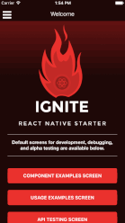

  

  :fire: The ideal starting app for React Native, best practices, generators, and more. :fire:
   
  
  
  
  
  

#### :earth_americas: [Tour Video and More on Ignite Web Page](https://infinite.red/ignite)

### Why Ignite?
* **No Need to Fork!**  Command-line Generator
  * Apps
  * Components/Styles
  * Containers (smart components)
  * Screens (opinionated containers)
  * _and more..._
* JS Code Standard - Standard Compliant
* ALL CODE works with iOS and Android
* Documented Structure
* **Battle Tested** - We use this!
* Redux State Management
* Optional Redux Persistence (uses AsyncStorage via [redux-persist](https://github.com/rt2zz/redux-persist))
* Redux Sagas
* Githooks
* AVA Tests - even React Native components!
* Code Coverage Reports
* API Ready
* Reactotron Ready
* Included Common Libs:
  * [react-native-vector-icons](https://github.com/oblador/react-native-vector-icons)
  * [react-native-animatable](https://github.com/oblador/react-native-animatable)
  * [react-native-i18n](https://github.com/AlexanderZaytsev/react-native-i18n)
  * [react-native-drawer](https://github.com/root-two/react-native-drawer)
  * [apisauce](https://github.com/skellock/apisauce)
  * [reduxsauce](https://github.com/skellock/reduxsauce)
  * [react-native-maps](https://github.com/lelandrichardson/react-native-maps)
* Included Developer Libs:
  * [reactotron](https://github.com/skellock/reactotron)
  * [AVA](https://github.com/avajs/ava)
  * [enzyme](https://github.com/airbnb/enzyme)
  * [react-native-mock](https://github.com/lelandrichardson/react-native-mock)
  * [mockery](https://github.com/mfncooper/mockery)
  * [nyc](https://github.com/bcoe/nyc)

To view the generated example project, just pull down the code and run ignite-base!

## :arrow_down: Install

Make sure you're setup for [React Native](https://facebook.github.io/react-native/docs/getting-started.html#content)

**Step 1: Install**

`npm install -g react-native-ignite`

**Step 2: Use**

`ignite new MyApplication`

## :arrow_forward: How to Run Generated App

1. cd to the repo
2. Run Build for either OS
  * for iOS
    * run the command `react-native run-ios`
  * for Android
    * Run Genymotion
    * run the command `react-native run-android`
3. _**Enjoy!**_

## :arrow_up: Built-In Generators

#### Generate an app: `ignite new MyApplication`
* The application generator uses the `ignite-base` template to provide a fresh application with all the common tech wired up and ready to roll.  Base applications come with common development screens, tools, and components.  _As for now, this is a 'Kitchen Sink' plan of attack.  Eventually to be paired down, and adjustable in v2.0_

#### Generate a component: `ignite generate component SmoothButton`
* The component generator creates a new 'dumb component' with the stylesheet.  Both files are created and placed in their appropriate folders.

#### Generate a container: `ignite generate container SubMenu`
* A generated container is a smart component that is connected to Redux.  Usually for containing other components.  The component and stylesheet are placed in the `Containers` folder.

#### Generate a screen: `ignite generate screen Settings`
* A generated screen, is an opinionated container, with a generated route.  Keyboard avoiding, and other base code is placed in this connected smart component.

#### Generate a listview: `ignite generate listview HotDates`
* React Native listview container with easy step by step instructions on how to get started with an easy list template.

#### COMING BACK SOON (broken in latest maps) - Generate a mapview: `ignite generate mapview MapScreen`
* react-native-maps container, component, and map helpers with easy step by step instructions on how to get started with an simple map screen.

#### Import images: `ignite import imagesfile`
* Imports all files in `Images` folder and converts the names into **key: value** pairs in the _image_ object inside of the `Images.js` file in the `Themes` folder.

## :twisted_rightwards_arrows: Where to Go From Here
#### [Contribute to Ignite](https://github.com/infinitered/ignite/blob/master/.github/CONTRIBUTING.md) - Getting up and running for your first pull request
#### [Chat with us on Gitter](https://gitter.im/infinitered/ignite?utm_source=badge&utm_medium=badge&utm_campaign=pr-badge&utm_content=badge) - Infinite Red devs standing by
#### [Chosen Tech Docs](https://github.com/infinitered/ignite/wiki/Chosen-Tech) - Understand the Tech Inside
#### [Roadmap Wiki Page](https://github.com/infinitered/ignite/wiki/Roadmap) - Future Plans of Ignite
#### [Who are We?](https://infinite.red) - Learn More About Infinite Red
#### [Project Web Page](http://infinitered.github.io/ignite/) - Our Github Page
